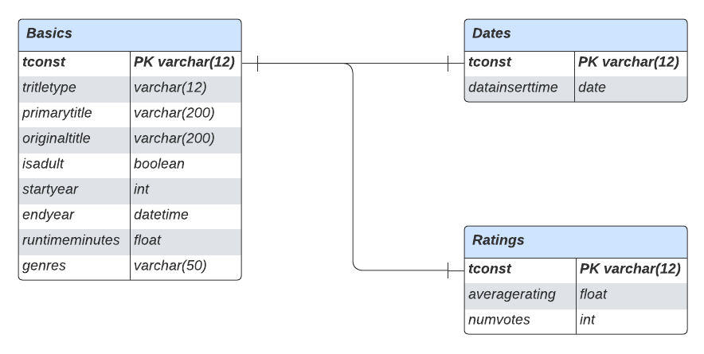

# trino_demo
Query engine demonstration with Trino

# Infrastructure 

## Deploy infrastructre

### Install

Make sure to have [terraform](https://developer.hashicorp.com/terraform/downloads?product_intent=terraform), make and [docker](https://www.docker.com) installed.

Go to `infra` folder then type 

```bash
make install
```

It will create 3 docker containers for each ressource. **You can acess Trino on your local machine via port `8080`.**

### Delete

In `infra` folder type
```bash
make uninstall
```

## Schema

Trino connected to MongoDB and MySQL inside private network. Instantiation using Terraform.


# Data model & segmentation

## Data model



## Segmentation

We choose to go save the most recent data (<10 days) on MongoDB and archive the remainings on MySQL.